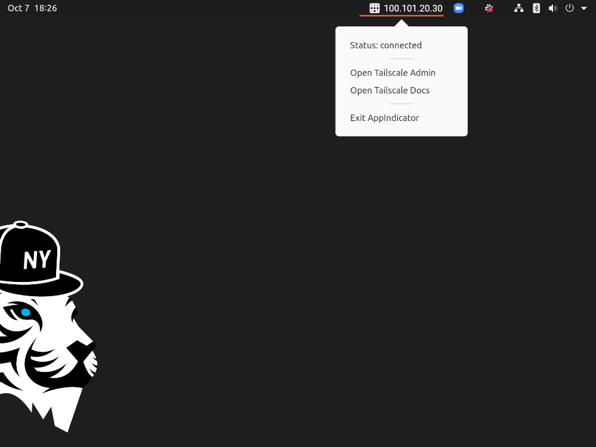

# Tailscale AppIndicator

[](https://app.circleci.com/github/felicianotech/tailscale-appindicator) [](https://raw.githubusercontent.com/felicianotech/tailscale-appindicator/master/LICENSE)

Tailscale AppIndicator is an Ubuntu AppIndicator for the simple yet powerful Tailscale network service.
This AppIndicator makes it easy to see your computer's Tailscale IP address, connection status, and provides shortcuts to open the Tailscale Admin site and Tailscale Docs.



## Installing

### Debian Package (.deb) Instructions

Download the `.deb` file to the desired system.

Via your browser you can download it from the [GitHub Releases page][gh-releases].
You can then double-click the file to install.

Via terminal, you can do the following:

```bash
wget https://github.com/felicianotech/tailscale-appindicator/releases/download/v0.1.0/tailscale-appindicator-v0.1.0-amd64.deb
sudo dpkg -i tailscale-appindicator-v0.1.0-amd64.deb
```

`0.1.0` and `amd64` may need to be replaced with your desired version and CPU architecture respectively.


## Starting

You can start the Tailscale AppIndicator by running the following:

```bash
systemctl --user start tailscale-appindicator
```

and keep it running between reboots:

```bash
systemctl --user enable tailscale-appindicator
```


## Updates

For now, you'll have to manually update by downloading new .debs and installing.
Watch this repo's releases to stay informed or just check back frequently.

## License

This repository is licensed under the MIT license.
The license can be found [here](./LICENSE).


[gh-releases]: https://github.com/felicianotech/tailscale-appindicator/releases
